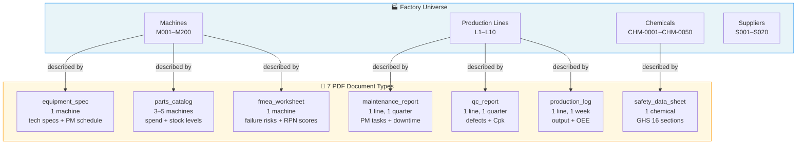
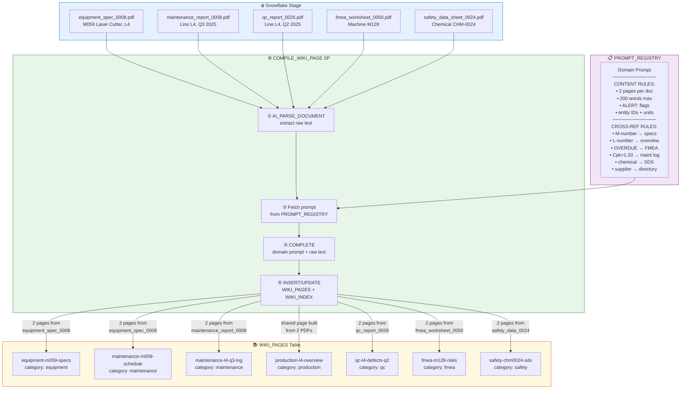
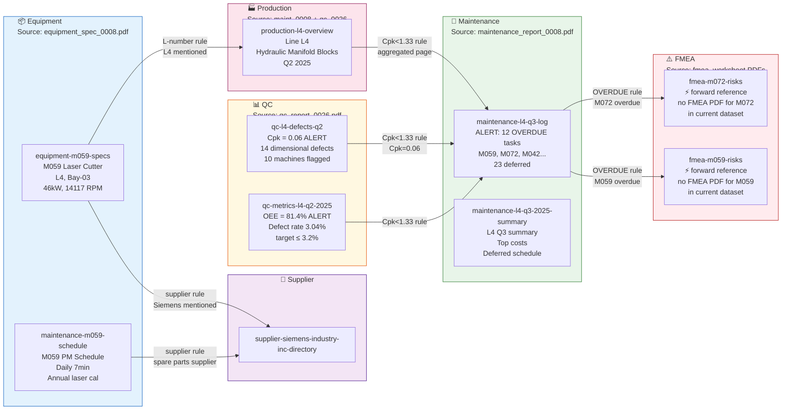
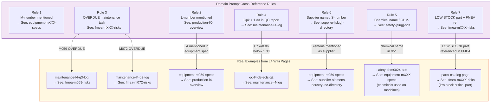
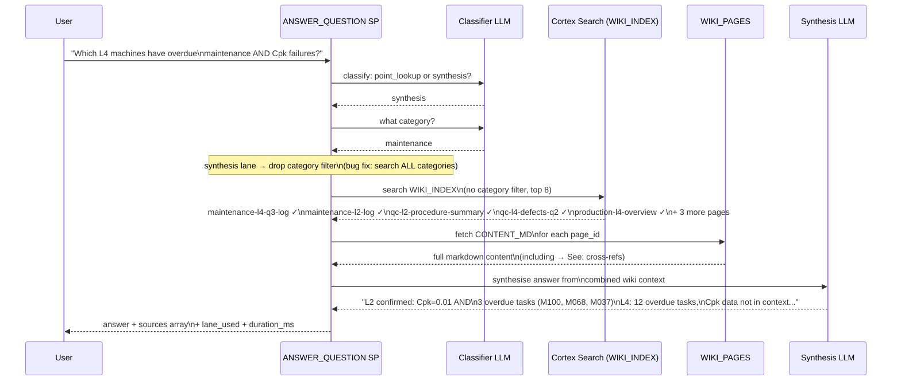
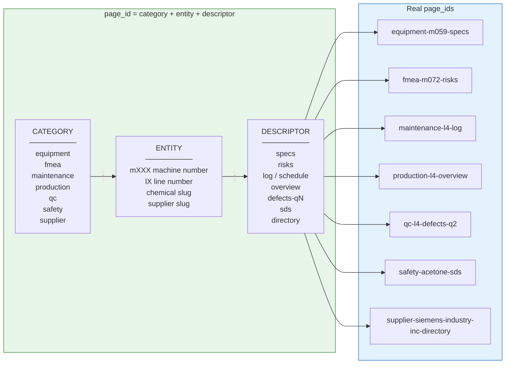

# PDF Relationships, Wiki Structure & Domain Prompt — Visual Guide

All diagrams use [Mermaid](https://mermaid.js.org/) syntax.
Render in GitHub, VS Code (Markdown Preview), Notion, or https://mermaid.live

---

## Diagram 1 — The 7 PDF Types and What They Describe

Each PDF type covers a different slice of the factory universe.



---

## Diagram 2 — How PDFs Compile Into Wiki Pages (The Domain Prompt in Action)



---

## Diagram 3 — The Cross-Reference Web (Real L4 Example)

This shows how `→ See:` links written into `CONTENT_MD` connect wiki pages
that were compiled from completely different PDFs.



---

## Diagram 4 — Which Domain Prompt Rule Creates Which Arrow



---

## Diagram 5 — How a Query Traverses the Wiki



---

## Diagram 6 — The page_id Naming Convention



---

## Quick Reference — PDF → Wiki Page → Cross-Ref Target

```
equipment_spec_0008.pdf (M059)
    │
    ├──► equipment-m059-specs        → See: production-l4-overview
    │                                → See: supplier-siemens-industry-inc-directory
    │
    └──► maintenance-m059-schedule   → See: supplier-siemens-industry-inc-directory

maintenance_report_0008.pdf (L4, Q3 2025)
    │
    ├──► maintenance-l4-q3-log       → See: fmea-m059-risks  (M059 OVERDUE)
    │                                → See: fmea-m072-risks  (M072 OVERDUE)
    │
    ├──► maintenance-l4-q3-2025-summary
    │
    └──► production-l4-overview      → See: maintenance-l4-log (Cpk rule)

qc_report_0026.pdf (L4, Q2 2025)
    │
    ├──► qc-l4-defects-q2            → See: maintenance-l4-log (Cpk=0.06 < 1.33)
    │
    └──► production-l4-overview      → See: maintenance-l4-log (shared page)

fmea_worksheet_0050.pdf (M128)
    │
    ├──► fmea-m128-risks             → See: maintenance-l3-log (high RPN)
    │
    └──► equipment-m128-overview     → See: production-l3-overview

safety_data_sheet_0024.pdf (CHM-0024)
    │
    ├──► safety-chm0024-sds
    │
    └──► equipment-chm0024-usage     → See: equipment-mXXX-specs (machine using it)
```
