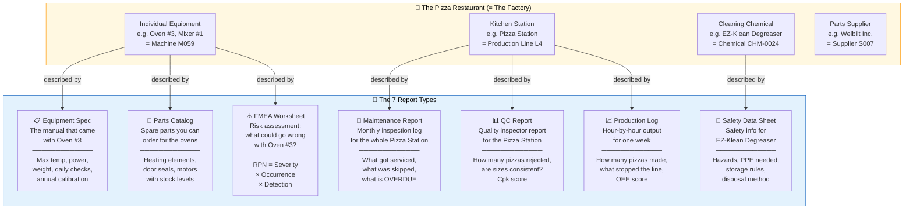
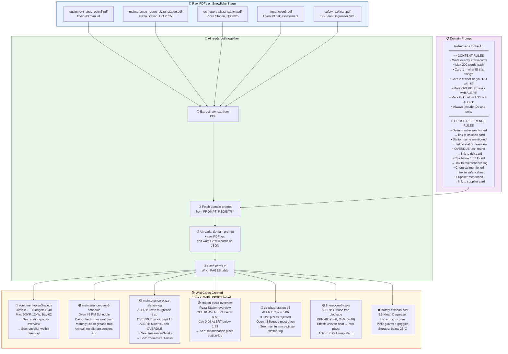
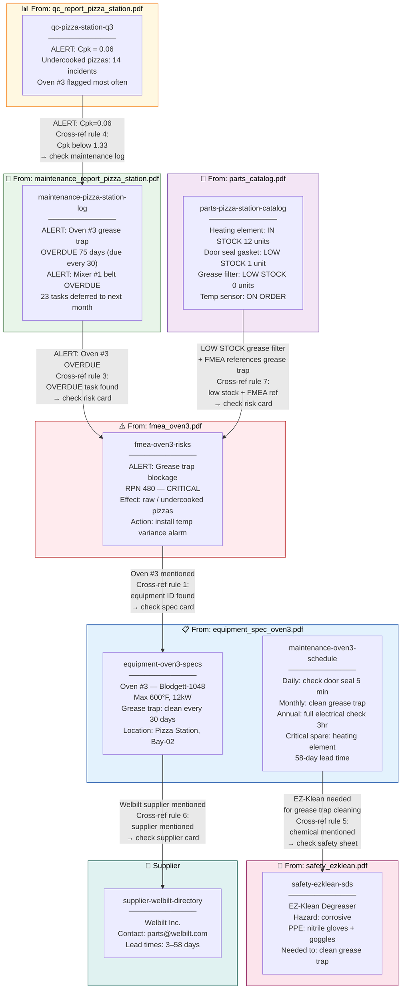
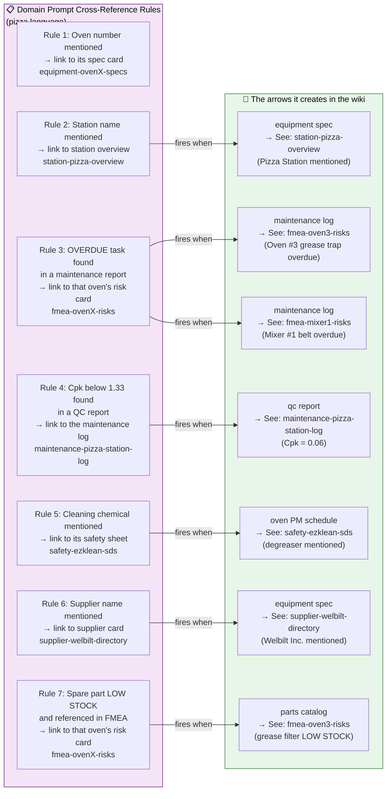
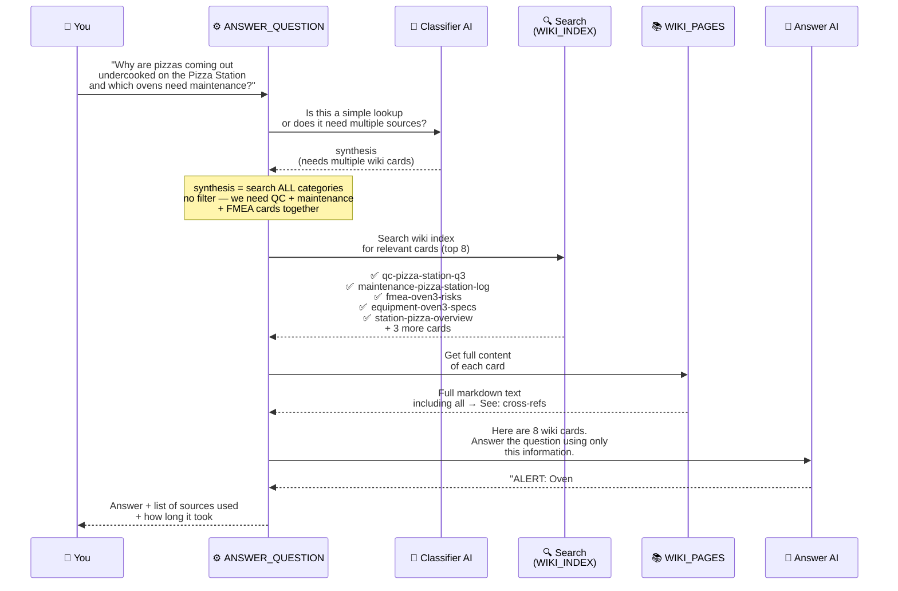
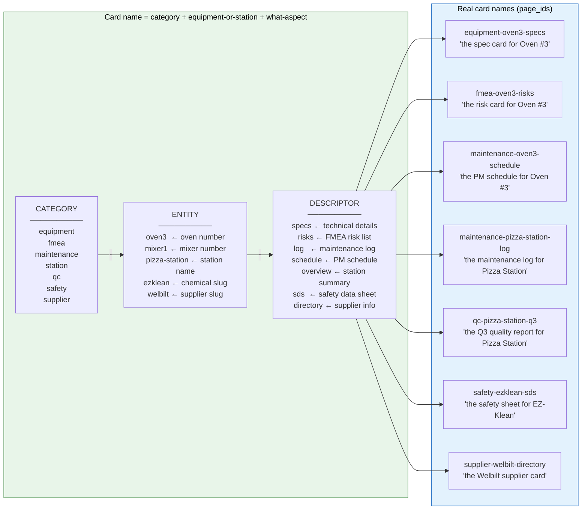

# PDF Relationships — Pizza Restaurant Edition

All diagrams use Mermaid. Render at https://mermaid.live or in VS Code / GitHub.

---

## Diagram 1 — The Pizza Restaurant and Its 7 Report Types



---

## Diagram 2 — How a PDF Becomes a Wiki Page (The Domain Prompt Pipeline)



---

## Diagram 3 — The Cross-Reference Web (Pizza Story)

This is the full chain: bad pizzas → find the root cause across 5 different PDFs.
Every arrow is a `→ See:` link written into the wiki card by the domain prompt.



---

## Diagram 4 — Domain Prompt Rules in Pizza Language

Each rule in the domain prompt creates one type of arrow in the wiki.



---

## Diagram 5 — Asking the Wiki a Question (Pizza Version)



---

## Diagram 6 — How Wiki Card Names Are Built (Pizza Version)

Every card has a name built from 3 parts so that cross-references always match.



---

## The Complete Pizza Story in One Picture

```
THE PROBLEM: Customers are complaining about undercooked pizzas.

┌─────────────────────────────────────────────────────────────────────┐
│  📊 QC Report (qc_report_pizza_station.pdf)                         │
│                                                                     │
│  ALERT: Cpk = 0.06  ← pizzas are wildly inconsistent in size/cook  │
│  14 undercooked incidents this month                                │
│  Oven #3 flagged most often                                         │
│                        │                                            │
│         Cross-ref rule 4: Cpk below 1.33                           │
│         → See: maintenance-pizza-station-log ──────────────────┐   │
└─────────────────────────────────────────────────────────────────│───┘
                                                                  │
┌─────────────────────────────────────────────────────────────────▼───┐
│  🔧 Maintenance Report (maintenance_report_pizza_station.pdf)        │
│                                                                     │
│  ALERT: Oven #3 grease trap OVERDUE — 75 days (should be 30 days)  │
│  ALERT: Mixer #1 belt OVERDUE — 47 days                             │
│                        │                                            │
│         Cross-ref rule 3: OVERDUE task found                       │
│         → See: fmea-oven3-risks ───────────────────────────────┐   │
└─────────────────────────────────────────────────────────────────│───┘
                                                                  │
┌─────────────────────────────────────────────────────────────────▼───┐
│  ⚠️ FMEA Worksheet (fmea_oven3.pdf)                                  │
│                                                                     │
│  Grease trap blockage: RPN = 480 ← CRITICAL (threshold is 100)     │
│  Severity=8, Occurrence=6, Detection=10                             │
│  Effect: uneven heat distribution → raw / undercooked pizzas        │
│  Recommended action: install temperature variance alarm             │
│                        │                                            │
│         Cross-ref rule 1: Oven #3 mentioned                        │
│         → See: equipment-oven3-specs ──────────────────────────┐   │
└─────────────────────────────────────────────────────────────────│───┘
                                                                  │
┌─────────────────────────────────────────────────────────────────▼───┐
│  📋 Equipment Spec (equipment_spec_oven3.pdf)                        │
│                                                                     │
│  Oven #3 — Blodgett-1048                                            │
│  Grease trap: MUST be cleaned every 30 days ← last done 75 days ago │
│  Supplier: Welbilt Inc.                                             │
│  Uses: EZ-Klean Degreaser for grease trap cleaning                  │
│          │                          │                               │
│  rule 6: supplier      rule 5: chemical mentioned                   │
│  → See: supplier-      → See: safety-ezklean-sds                   │
│    welbilt-directory         │                                      │
└──────────────────────────────│──────────────────────────────────────┘
                               │
┌──────────────────────────────▼──────────────────────────────────────┐
│  🧪 Safety Data Sheet (safety_ezklean.pdf)                           │
│                                                                     │
│  EZ-Klean Industrial Degreaser                                      │
│  ⚠️  Corrosive — causes skin burns                                   │
│  PPE required: nitrile gloves + safety goggles + apron             │
│  Storage: below 25°C, away from food                               │
│  Tell the maintenance team before they start cleaning Oven #3!      │
└─────────────────────────────────────────────────────────────────────┘

ALSO CHECK:
┌─────────────────────────────────────────────────────────────────────┐
│  🛒 Parts Catalog                                                    │
│                                                                     │
│  Grease trap filter: LOW STOCK — 0 units left                      │
│  (cross-ref rule 7: LOW STOCK + FMEA references grease trap)        │
│  → See: fmea-oven3-risks                                            │
│  Order immediately — 14-day lead time!                              │
└─────────────────────────────────────────────────────────────────────┘

ROOT CAUSE FOUND: Oven #3 grease trap not cleaned for 75 days.
NEXT STEPS:
  1. Order grease trap filters (0 in stock, 14-day lead)
  2. Get PPE (gloves + goggles per safety sheet)
  3. Clean the grease trap
  4. Install temperature variance alarm (per FMEA recommendation)
```
